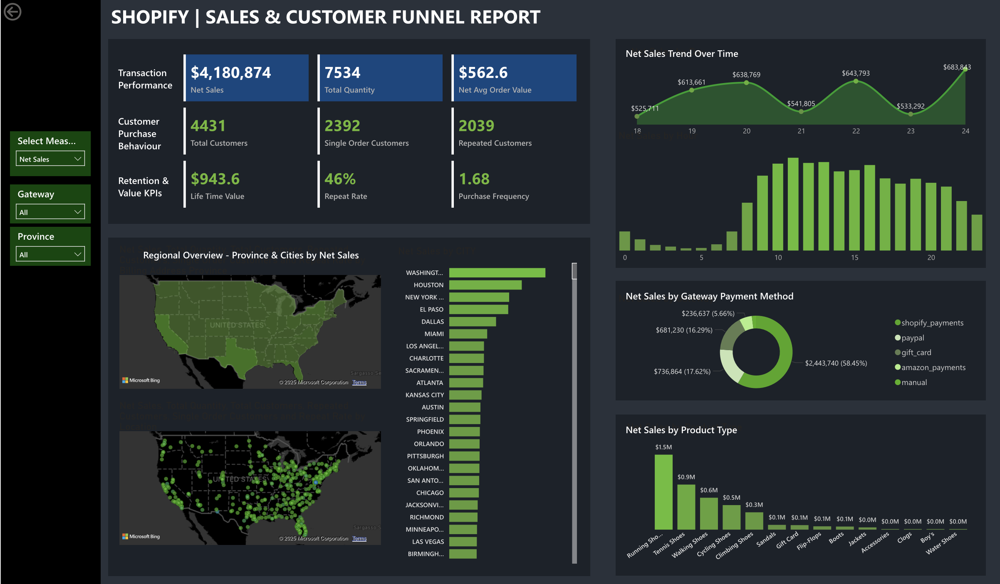

# Shopify Sales & Customer Funnel Report

## Overview
This Power BI project provides a comprehensive dashboard for analyzing Shopify sales and customer funnel metrics. It includes key performance indicators (KPIs), regional sales data, payment method breakdowns, and product type performance.

 

## Features
- **Transaction Performance**: Total net sales ($4,180,874), total quantity (7,534), and net average order value ($562.6).
- **Customer Behavior**: Total customers (4,431), single order customers (2,392), repeated customers (2,039).
- **Retention KPIs**: Lifetime value ($943.6), repeat rate (46%), purchase frequency (1.68).
- **Regional Overview**: Map-based visualization of net sales by province and cities across the United States.
- **Sales Trends**: Net sales trend over time (daily data from 18th to 24th).
- **Payment Methods**: Breakdown of net sales by gateway payment methods (e.g., Shopify Payments, PayPal).
- **Product Analysis**: Net sales by product type (e.g., Running Shoes, Tennis Shoes).

## Prerequisites
- [Power BI Desktop](https://powerbi.microsoft.com/desktop/) installed.
- Access to Shopify data (if refreshing data sources).

## Notes
- The `.pbix` file contains aggregated data as of May 20, 2025.
- Avoid uploading sensitive data (e.g., raw customer details) to maintain privacy.
- For large file issues, consider using Git LFS or splitting the project.

## Contributing
Feel free to fork this repository, make improvements, and submit pull requests. Ensure any changes are documented in the `README.md`.

## Contact
For questions, open an issue in this repository.
